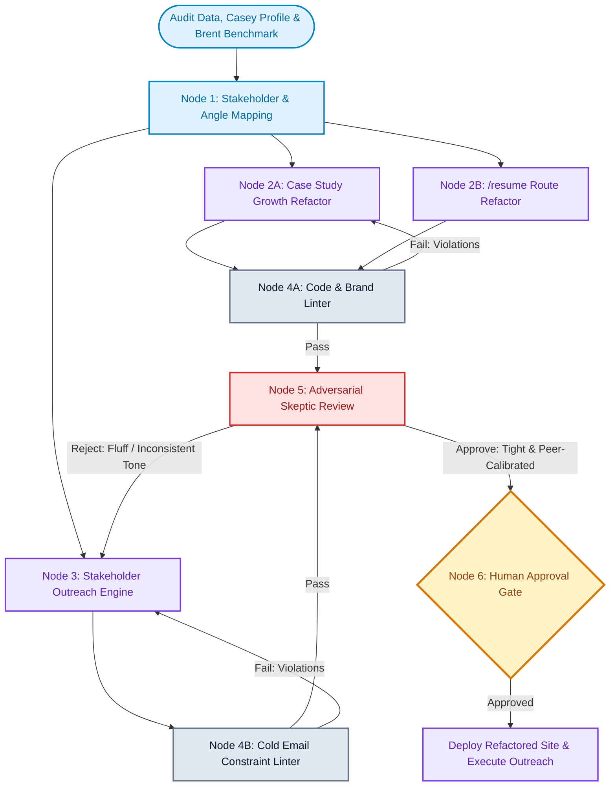

# Everlaw Pitch Campaign, /resume Elevation & Project Evolution Plan

An end-to-end plan to elevate the **Everlaw Marketing Web Case Study** and **Tailored `/resume` Route** (`rl22.github.io/everlaw`), and execute a targeted, high-converting outreach campaign to key decision-makers at Everlaw—led by direct hiring manager **Casey Sullivan**, CMO **Joshua Schnoll**, Demand Gen leadership (**Kendal Mott**, **Adam Rector**), and technical IC peer **Nick DiGeronimo**.

---

## User Review Required

> [!IMPORTANT]
> **Primary Contact & Reporting Line**:
> - **Casey Sullivan** (Direct Manager / Hiring Manager): Lawyer (J.D.), marketer, writer, educator (M.S.Ed). Outreach will be tailored to his unique intersection of legal precision, content integrity, and marketing creativity—specifically showcasing the *Deep Dive Verified Claims Engine* on the reference build.
>
> **Scope Expansion (/resume Route)**:
> - The live resume route at `/resume` (`app/resume/page.tsx`) will be upgraded to ensure 100% synchronization with the canonical **"30% fewer marketing dev requests at Carrot"** rule, elevating the bullet points to the Brent Grainger "Growth Platform" bar, and reinforcing Senior IC ownership.

---

## /map-graph Architecture & Execution Protocol

Below is the updated 6-step agent graph engineering specification incorporating the expanded scope (/resume + Casey Sullivan).

### 1. Goal & Output Contract
* **Goal**: Deliver a polished, commercialized case study at `rl22.github.io/everlaw` and synchronized `/resume` route, paired with 5 personalized, peer-to-peer outreach email sequences targeting Everlaw stakeholders (led by direct manager Casey Sullivan).
* **Raw Inputs**: 500-page Everlaw audit data (`everlaw-audit-source.json`), Casey Sullivan profile (J.D., marketer, writer), Brent Grainger benchmark profile, `PRODUCT.md` brand guidelines, and `/resume/page.tsx`.
* **Output Deliverable**: Reframed case study copy/sections, elevated `/resume` code, 5 targeted email packages (Initial + Follow-up + Breakup) formatted in Markdown, and test suite logs.

### 2. Node Topology Deconstruction
1. **Node 1: Stakeholder & Angle Classifier (Tier 1 - Fast Triage)**: Maps stakeholder personas to bespoke angles:
   - **Casey Sullivan (Direct Hiring Manager)** $\rightarrow$ Legal tech precision, marketing publishing velocity, verified claims governance.
   - **Joshua Schnoll (CMO)** $\rightarrow$ AI-search (GEO/AEO) discoverability & pipeline growth engine.
   - **Kendal Mott (Marketing & Demand Gen Leader)** $\rightarrow$ Campaign velocity & self-serve landing page systems.
   - **Adam Rector (Sr. Manager, Demand Gen)** $\rightarrow$ Paid landing page LCP optimization & conversion protection.
   - **Nick DiGeronimo (Web Developer II)** $\rightarrow$ Component architecture & automated release gates.
2. **Node 2: Case Study & `/resume` Refactor (Tier 2 - Frontier Workhorse)**: Upgrades `CaseStudy.tsx`, `content.ts`, and `app/resume/page.tsx` to match the "Growth Product" standard and enforce the canonical 30% metric.
3. **Node 3: Stakeholder Copywriting Engine (Tier 2 - Frontier Workhorse)**: Drafts 5 cold email sequences applying `cold-email`, `copywriting`, and `ai-seo` skills.
4. **Node 4: Deterministic Guardrail Linter (Tier 0 - Automated)**: Validates constraints (word count $\le 100$, 0 prohibited buzzwords, exact 30% Carrot phrasing, valid TypeScript & Next.js builds).
5. **Node 5: Adversarial Skeptic & Tone Reviewer (Tier 3 - Deep Reasoning)**: Audits copy against vendor tone, template feel, or unverified claims; verifies high-craft "Confident Craftsman" voice.
6. **Node 6: Human Approval Gate (User)**: Final review of live code and outreach assets.

### 3. Model Tier Routing & Effort Binding
* **Tier 0 (Deterministic)**: Regex / linters / AST / `npm run test` / `npm run test:e2e` (Effort: N/A)
* **Tier 1 (Fast Triage)**: Stakeholder classification & angle mapping (`Gemini Flash` / `Haiku`) (Effort: Light)
* **Tier 2 (Frontier Workhorse)**: Copywriting, `/resume` refactor, case study narrative updates (`Gemini Pro` / `Sonnet 5`) (Effort: Medium)
* **Tier 3 (Deep Reasoning Skeptic)**: Tone calibration, claims verification, and adversarial email critique (`Claude 4.6 Thinking` / `Gemini 3.1 Pro Thinking`) (Effort: High)

### 4. Shared State Payload Schema (`GraphState`)
```typescript
interface GraphState {
  targetCompany: "Everlaw";
  hiringManager: {
    name: "Casey Sullivan";
    role: "Direct Manager / Marketing Leader";
    background: "J.D., M.S.Ed, writer, marketer";
    angle: "claims_integrity_and_publishing_velocity";
  };
  stakeholders: Array<{
    name: string;
    role: string;
    email: string;
    angle: string;
    framework: string;
    drafts: {
      subject: string;
      body: string;
      followUp: string;
    };
    linterPassed: boolean;
    skepticApproved: boolean;
  }>;
  resumeScope: {
    path: "app/resume/page.tsx";
    standardMetric: "30% fewer marketing dev requests at Carrot";
    framing: "Growth Platform & Headless CMS at Scale";
    status: "pending_edit";
  };
  metrics: {
    pagesAudited: 500;
    invalidSchemaPages: 494;
    lcpWarningPages: 288;
  };
}
```

### 5. Visual Graph Workflow Diagram



---

## Proposed Changes

### Component 1: `/resume` Route & Case Study Refactor

#### [MODIFY] [app/resume/page.tsx](file:///Users/rodneylewis/Sprintz/jobs/everlaw/app/resume/page.tsx)
* **Standardize Carrot Metric**: Update Carrot Fertility bullet to the exact verified phrasing: *"Architected modular Webflow templates that reduced marketing dev requests by 30% and returned roadmap capacity to engineering."*
* **Elevate Growth & Platform Bullets**:
  * Pendo: *"Built modular landing-page architecture on headless WordPress, enabling demand gen to launch multi-stage campaigns without engineering tickets."*
  * Sprintz: *"Architect high-performance web platforms and AI-native delivery workflows that combine Next.js, Sanity headless CMS, and automated Playwright release gates."*
* **Sharpen Capabilities**: Structure around *Marketing Web Platform Ownership, Headless CMS at Scale, Core Web Vitals & Technical SEO, Component Systems & Content Velocity*.

#### [MODIFY] [app/content.ts](file:///Users/rodneylewis/Sprintz/jobs/everlaw/app/content.ts) & [app/CaseStudy.tsx](file:///Users/rodneylewis/Sprintz/jobs/everlaw/app/CaseStudy.tsx)
* Infuse the "Growth Engine & AI Discoverability" narrative into the Hero, Summary, and Initiatives (connecting the 494 invalid schema pages to LLM/GEO citation risks and 288 LCP warnings to conversion drop-off).

---

### Component 2: Stakeholder Pitch Sequences (5 Contacts)

#### [NEW] [everlaw_outreach_sequences.md](file:///Users/rodneylewis/.gemini/antigravity/brain/f00aa9c4-ac04-42c6-b078-f589bc1577fc/everlaw_outreach_sequences.md)

1. **Casey Sullivan (Direct Manager / Marketing Leader)** — *Angle: Legal Claims Rigor + Marketing Publishing Velocity*
   * *Email*: `casey.sullivan@everlaw.com`
   * *Subject*: `deep dive claims & release gate`
   * *Opening*: Acknowledge Casey's background bridging legal rigor and creative marketing; note the challenge of keeping marketing fast while ensuring AI claims stay cited and accurate.
   * *Pitch Hook*: Audited 500 pages on everlaw.com and built a working prototype at `rl22.github.io/everlaw` featuring an automated release gate that validates Deep Dive claims against source docs before publishing.
   * *Proof*: Reduced marketing dev requests by 30% at Carrot through modular components.
   * *CTA*: "Built the working prototype here: rl22.github.io/everlaw. Would love your take if you're open to it."

2. **Joshua Schnoll (CMO)** — *Angle: AI-Search (GEO) Discoverability & Revenue Risk*
   * *Email*: `joshua.schnoll@everlaw.com`
   * *Subject*: `everlaw.com ai search`
   * *Hook*: 494/500 audited pages have broken JSON-LD serializers, creating blind spots for ChatGPT Search / Perplexity citations.
   * *Proof*: 30% fewer marketing dev requests at Carrot, headless CMS at scale.
   * *CTA*: "Put together a working reference build fixing the generator at rl22.github.io/everlaw. Worth a quick look?"

3. **Kendal Mott (Marketing & Demand Gen Leader)** — *Angle: Campaign Velocity & Self-Serve CMS*
   * *Email*: `kendal.mott@everlaw.com`
   * *Subject*: `demand gen velocity`
   * *Hook*: Demand gen campaigns moving fast shouldn't be bottlenecked by dev tickets or fragile templates.
   * *Proof*: Engineered self-serve component libraries at Pendo and Carrot.
   * *CTA*: "Mapped out a 5-initiative operating roadmap for everlaw.com. Open to checking it out?"

4. **Adam Rector (Sr. Manager, Demand Gen)** — *Angle: Paid Ad Landing Page LCP & Conversion*
   * *Email*: `adam.rector@everlaw.com`
   * *Subject*: `lcp on landing pages`
   * *Hook*: 288 pages show LCP resource-priority warnings directly impacting paid ad Quality Scores and bounce rates.
   * *Proof*: Core Web Vitals optimization across enterprise SaaS.
   * *CTA*: "Built a live release gate testing these templates at rl22.github.io/everlaw. Happy to share the teardown."

5. **Nick DiGeronimo (Web Developer II)** — *Angle: Headless CMS Architecture & Automated Release Gates*
   * *Email*: `nick.digeronimo@everlaw.com`
   * *Subject*: `schema generator fix`
   * *Hook*: Spotted the JSON-LD serialization pattern across 494 pages in a single crawl.
   * *Proof*: Automated Vitest/Playwright CI release gates.
   * *CTA*: "Put the architecture and repo together at rl22.github.io/everlaw. Curious how your current deploy gates are structured."

---

## Verification Plan

### Automated Build & Test Suite
* Run unit, component, typecheck, and E2E suites on `/Users/rodneylewis/Sprintz/jobs/everlaw`:
  ```bash
  cd /Users/rodneylewis/Sprintz/jobs/everlaw && npm run test && npm run typecheck
  ```
* Run Playwright accessibility scans (WCAG 2.1 AA, 0 violations):
  ```bash
  cd /Users/rodneylewis/Sprintz/jobs/everlaw && npx playwright test
  ```

### Copywriting & Deliverability Checks
* **Word count audit**: Confirm all 5 initial outreach emails are $<100$ words (target: 65–85 words).
* **Subject line audit**: Confirm all subject lines are 2–4 words, lowercase, internal-looking.
* **Strict metric check**: Confirm exact match: `"30% fewer marketing dev requests at Carrot"` across `/resume` and case study copy.
