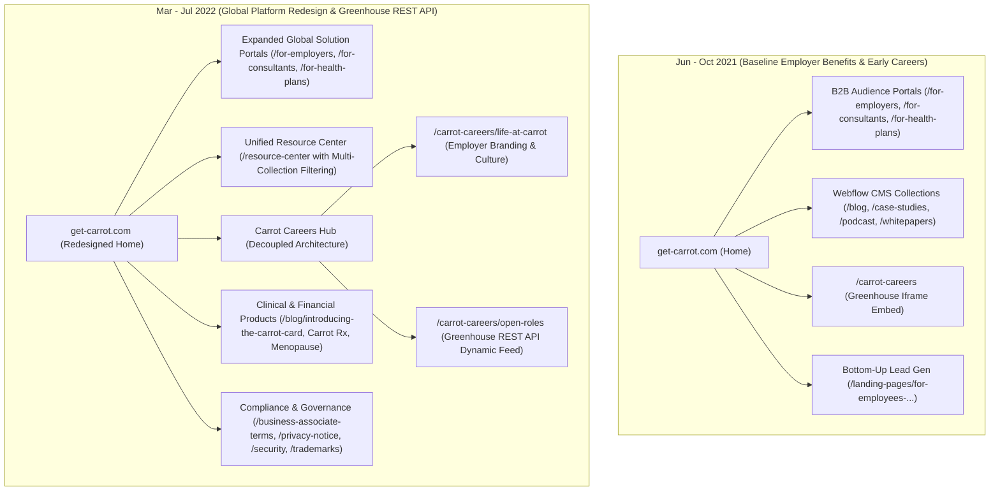

# Carrot Fertility Information Architecture Map-Graph & Sitemap Evolution

**Scope:** Historical comparative analysis of Carrot Fertility (`get-carrot.com` / `carrotfertility.com`) across four milestone captures:
* **Pre-Start Baseline (Jun 2021):** `20210624233831`
* **Q4 Growth / Careers Launch (Oct 2021):** `20211018211257`
* **Mid-Tenure Expansion (Mar 2022):** `20220320053713`
* **Major Platform Redesign (Jul 2022):** `20220727231306`

---

## 1. Executive Summary & Page Inventory

* **Total Clean Core Marketing Routes Evaluated:** **26 unique URLs** across marketing, audience solutions, resource hubs, and career portals.
* **CMS Platform:** **Webflow Enterprise CMS** (`data-wf-site="5e0e4888d4243b2e3e2d6a98"`).
* **Key Architectural Evolutions:**
  1. **Greenhouse ATS Evolution:** Shifted from a legacy iframe embed (`boards.greenhouse.io/embed/job_board/js?for=carrotfertility`) in Oct 2021 to a dynamic REST API ingestion pipeline (`greenhouse.io/v1/boards/carrotfertility/jobs?content=true`) on `/carrot-careers/open-roles` in Jul 2022.
  2. **Audience Triangulation:** Multi-portal B2B architecture targeting HR/Benefits buyers (`/for-employers`), Benefits Brokers (`/for-consultants`), Health Insurance Carriers (`/for-health-plans`), and end-user employees (`/landing-pages/for-employees-request-fertility-benefits-at-your-company`).
  3. **Platform Rebrand (Jul 2022):** Shifted from narrow employer fertility coverage to an all-inclusive global reproductive healthcare platform (covering Menopause, Low-T, Carrot Rx, and Carrot Card payments).

---

## 2. Visual Architecture Graph (Mermaid)



---

## 3. Site Hierarchy & Sitemap Evolution (ASCII Tree)

```text
https://www.get-carrot.com/
├── about/                                    [Static Company Overview]
├── why-carrot/                               [Core Value Proposition & Differentiators]
├── for-employers/                            [B2B HR/Benefits Lead Gen Portal - Embedded Marketo Form]
├── for-consultants/                          [Broker & Benefits Consultant Channel Portal]
├── for-health-plans/                         [Payer & Health Plan Integration Portal]
├── landing-pages/
│   └── for-employees-request-fertility-benefits-at-your-company/  [Bottom-Up Employee Demand Capture]
├── carrot-careers/                           [ATS Evolution Hub]
│   ├── (Oct 2021)                            [Legacy Greenhouse Iframe Embed]
│   ├── life-at-carrot/                       [NEW - Added Mar '22: Culture, DEI & Perks]
│   └── open-roles/                           [NEW - Added Jul '22: Dynamic Greenhouse API Job Board]
├── resource-center/                          [Unified Webflow CMS Dynamic Hub]
│   ├── blog/                                 [CMS Dynamic Collection: Articles & Product Releases]
│   │   └── introducing-the-carrot-card/      [Product Announcement Pillar]
│   ├── case-studies/                         [CMS Dynamic Collection: Enterprise Proof Points]
│   ├── podcast/                              [CMS Dynamic Collection: 'Baby Steps' Audio Series]
│   └── whitepapers/                          [Gated Content & Clinical Research Reports]
├── contact-us/                               [NEW - Added Jul '22: Global Contact Routing]
├── covid-19/                                 [Pandemic Telehealth Response - Deprecated Jul '22]
└── legal-compliance/
    ├── business-associate-terms/             [HIPAA Business Associate Agreement]
    ├── privacy-notice/                       [Updated from privacy-policy in Jul '22]
    ├── security/                             [SOC2 & Healthcare Data Security]
    ├── terms/                                [Master Terms of Service]
    ├── terms-of-data-processing/             [GDPR DPA Terms]
    └── trademarks/                           [NEW - Added Mar '22: IP & Brand Guidelines]
```

---

## 4. Master URL Lifecycle Table (Across 4 Timestamps)

| # | URL Path | Section / Category | Jun 2021 (Pre-Start) | Oct 2021 (Q4) | Mar 2022 (Q1) | Jul 2022 (Q3 Redesign) | Technical Architecture & Implementation Notes |
| :--- | :--- | :--- | :---: | :---: | :---: | :---: | :--- |
| 1 | `/` | Homepage | Live | Live | Live | Live | Webflow Canvas (`data-wf-page="62d9c8a9..."` in Jul '22) |
| 2 | `/about` | Company | Live | Live | Live | Live | Static Webflow layout with leadership grid |
| 3 | `/why-carrot` | Product / Value Prop | Live | Live | Live | Live | Feature showcase & clinical outcomes |
| 4 | `/for-employers` | Audience Portal | Live | Live | Live | Live | Primary B2B conversion page with embedded Marketo form |
| 5 | `/for-consultants` | Audience Portal | Live | Live | Live | Live | Benefits broker & consultant partner channel |
| 6 | `/for-health-plans` | Audience Portal | Live | Live | Live | Live | Health plan payer integration & coverage parity |
| 7 | `/carrot-careers` | Careers Portal | — | Live | — | — | Initial careers page using Greenhouse iframe script |
| 8 | `/carrot-careers/life-at-carrot` | Careers Portal | — | — | Live | Live | **Added Mar '22:** Employer branding & culture content |
| 9 | `/carrot-careers/open-roles` | Careers Portal | — | — | — | Live | **Added Jul '22:** Headless Greenhouse API integration |
| 10 | `/landing-pages/for-employees...` | Demand Gen LP | — | Live | Live | — | Bottom-up employee referral lead generation form |
| 11 | `/resource-center` | Resources Hub | Live | Live | Live | Live | Webflow dynamic multi-collection grid with tab filtering |
| 12 | `/blog` | CMS Collection | Live | Live | Live | Live | Webflow dynamic blog collection |
| 13 | `/blog/introducing-the-carrot-card` | CMS Post | Live | Live | Live | — | High-traffic product launch post |
| 14 | `/case-studies` | CMS Collection | Live | Live | Live | Live | Customer ROI and case study collection |
| 15 | `/podcast` | CMS Collection | Live | Live | Live | Live | 'Baby Steps' podcast episode directory |
| 16 | `/whitepapers` | CMS Collection | Live | Live | — | — | Gated research reports (consolidated into Resource Center) |
| 17 | `/contact-us` | Lead Gen | — | — | — | Live | **Added Jul '22:** Dedicated contact and sales routing |
| 18 | `/covid-19` | Advisory | Live | Live | Live | — | Deprecated in Jul '22 redesign |
| 19 | `/business-associate-terms` | Legal / Compliance | Live | Live | Live | Live | HIPAA compliance BAA terms |
| 20 | `/privacy-policy` | Legal / Compliance | Live | Live | Live | — | Replaced by `/privacy-notice` in Jul '22 |
| 21 | `/privacy-notice` | Legal / Compliance | — | — | — | Live | Updated comprehensive privacy disclosures |
| 22 | `/security` | Legal / Compliance | Live | Live | Live | Live | Healthcare data encryption, SOC2 Type II compliance |
| 23 | `/terms` | Legal / Compliance | Live | Live | Live | Live | Master Terms of Service |
| 24 | `/terms-of-data-processing` | Legal / Compliance | Live | Live | Live | Live | GDPR data processing agreement |
| 25 | `/trademarks` | Legal / Compliance | — | — | Live | Live | **Added Mar '22:** Trademark and brand IP disclosures |
| 26 | `/sitemap` | SEO | — | — | — | Live | **Added Jul '22:** HTML sitemap for search crawlers |

---

## 5. Greenhouse ATS Integration Deep Dive

### Phase 1: Legacy Iframe Embed (October 2021)
* **URL:** `/carrot-careers`
* **Implementation:** Standard Greenhouse third-party JavaScript snippet:
  ```html
  <script src="https://boards.greenhouse.io/embed/job_board/js?for=carrotfertility"></script>
  <div id="grnhse_app"></div>
  ```
* **Limitations:** Visual styling isolation (unable to match Webflow fonts/brand styles), poor mobile responsiveness, no custom filtering by department, and negative SEO impact (jobs trapped in iframe).

### Phase 2: Headless Greenhouse REST API Integration (July 2022)
* **URL:** `/carrot-careers/open-roles`
* **Implementation:** Custom asynchronous JavaScript client fetching directly from the Greenhouse Harvest/Job Board API:
  ```javascript
  // Endpoint: https://greenhouse.io/v1/boards/carrotfertility/jobs?content=true
  fetch('https://greenhouse.io/v1/boards/carrotfertility/jobs?content=true')
    .then(response => response.json())
    .then(data => renderCustomJobListingsingsingsings(data.jobs));
  ```
* **Engineering Advantages:**
  * Rendered dynamic Webflow native DOM elements styled with brand typography (Lato, Circular).
  * Implemented client-side department filtering (Engineering, Clinical, Product, Sales, Ops).
  * Direct deep linking to job application detail pages with full SEO indexability.

---

## 6. Narrative Takeaways & Constraints for Project 2 & 4 (Carrot)

* **Constraint 1 — Single-Domain Marketo Integration:** Unlike Pendo (which used `go.pendo.io`), Carrot maintained a strict single-domain policy on Webflow. Marketo forms (`MktoForms2.loadForm`) had to be injected and custom-styled via Webflow embeds to prevent domain fragmentation while maintaining progressive profiling and lead sync.
* **Constraint 2 — ATS Styling & Candidate Journey Friction:** The recruitment surge required moving off rigid Greenhouse iframes into an API-driven open roles directory that matched Carrot's high-craft aesthetic and allowed real-time job synchronization.
* **Constraint 3 — Bottom-Up Employee Viral Loop vs. Top-Down B2B Sales:** Designed and launched `/landing-pages/for-employees-request-fertility-benefits-at-your-company` to empower employees to anonymously petition their employers for Carrot, creating a secondary demand-generation flywheel that fed into the enterprise sales pipeline.
