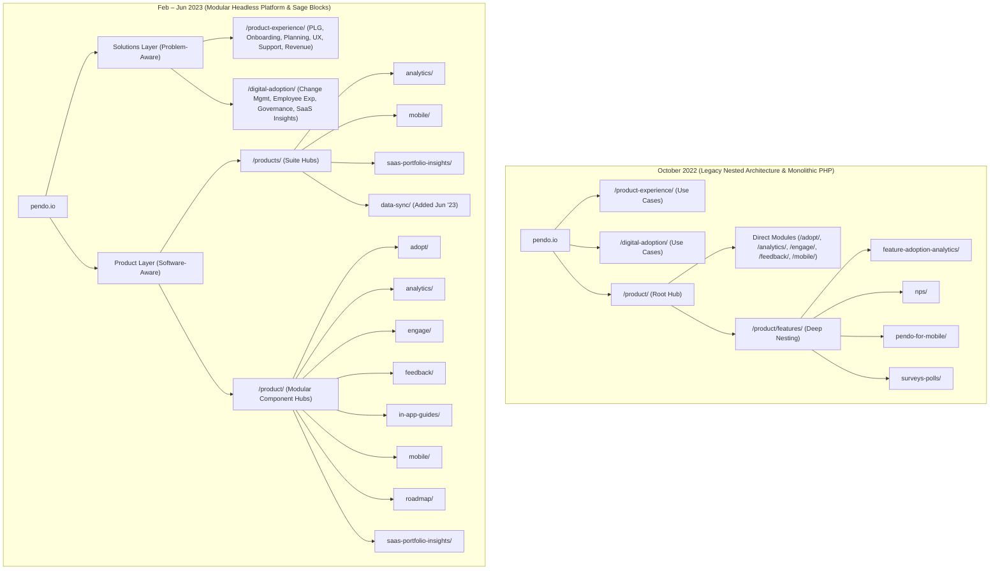

# Implementation Plan: Pendo Information Architecture Analysis

Based on our direct scrape of the Pendo DOM across Oct 2022, Feb 2023, and June 2023, we have mapped the URL structures, post/page/template types, and MarTech evolution.

## 1. Page Inventory & Totals
* **Total Unique Pages Affected:** **37 pages**
* **Migration Window:** **Between October 2022 and February 2023 (Q4 2022 – Q1 2023)**

### Breakdown by Pillar
| Pillar | URL Pattern | Unique Pages |
| :--- | :--- | :---: |
| **Product Modules** | `/product/*` | 14 |
| **Product Suites** | `/products/*` | 4 |
| **Product Experience Solutions** | `/product-experience/*` | 9 |
| **Digital Adoption Solutions** | `/digital-adoption/*` | 10 |
| **TOTAL** | | **37** |

---

## 2. Post, Page, and Template Type Analysis

* **Post Type:** Standard WordPress hierarchical `page` post type.
* **Parent-Child Hierarchy Tree:**
  * `parent-pageid-1958`: Root parent for all **Product Modules** (`/product/adopt/`, etc.).
  * `parent-pageid-6007`: Root parent for all **Product Experience Solutions** (`/product-experience/user-onboarding/`, etc.).
  * `parent-pageid-6009`: Root parent for all **Digital Adoption Solutions** (`/digital-adoption/employee-productivity/`, etc.).
* **Template Evolution:**
  * **Oct 2022:** Monolithic PHP layout templates (`page-template-template-component-layout` / `pendo-components` theme).
  * **Feb 2023 & Jun 2023:** Modular component blocks (`page-template-default wp-embed-responsive` / **Roots Sage `timber-sage-starter`** framework).

---

## 3. MarTech & Tech Stack Evolution

| MarTech / Tooling Layer | October 2022 | February 2023 | June 2023 |
| :--- | :--- | :--- | :--- |
| **Theme Engine** | `pendo-components` | `timber-sage-starter` (Roots Sage) | `timber-sage-starter` (Roots Sage) |
| **Personalization & CRO** | Mutiny (`64c4277f45fc6bf8`) | Mutiny (`64c4277f45fc6bf8`) | Mutiny (`64c4277f45fc6bf8`) |
| **Marketing Automation** | Marketo (Forms 2.0) | Marketo (Forms 2.0) | Marketo (Forms 2.0) |
| **Tag Management** | `GTM-NRJ68V` | `GTM-MBJ22KN` (Overhauled Container) | `GTM-MBJ22KN` |
| **Attribution** | None observed | **Bizible (Marketo Measure)** | **Bizible (Marketo Measure)** |
| **Chatbot** | Drift | Removed | Removed |
| **Privacy & Consent** | OneTrust | OneTrust | OneTrust |

---

## 4. Visual Architecture Map (Mermaid)

*Full URL map table and detailed technical breakdowns are saved in [pendo-ia-map-graph.md](file:///Users/rodneylewis/.gemini/antigravity/brain/fe7a155d-afee-4a93-8fd4-8f5988e7dc37/pendo-ia-map-graph.md).*
