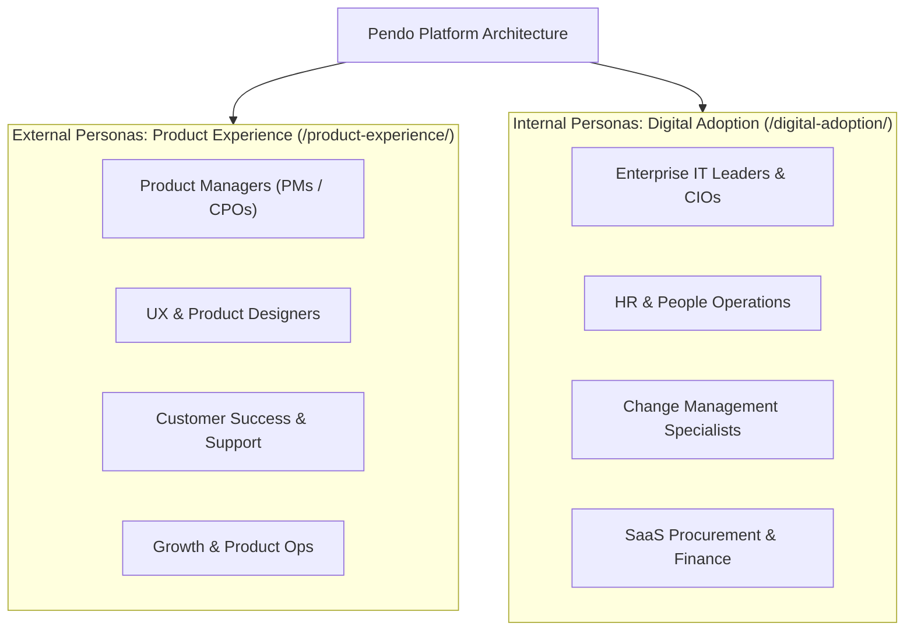
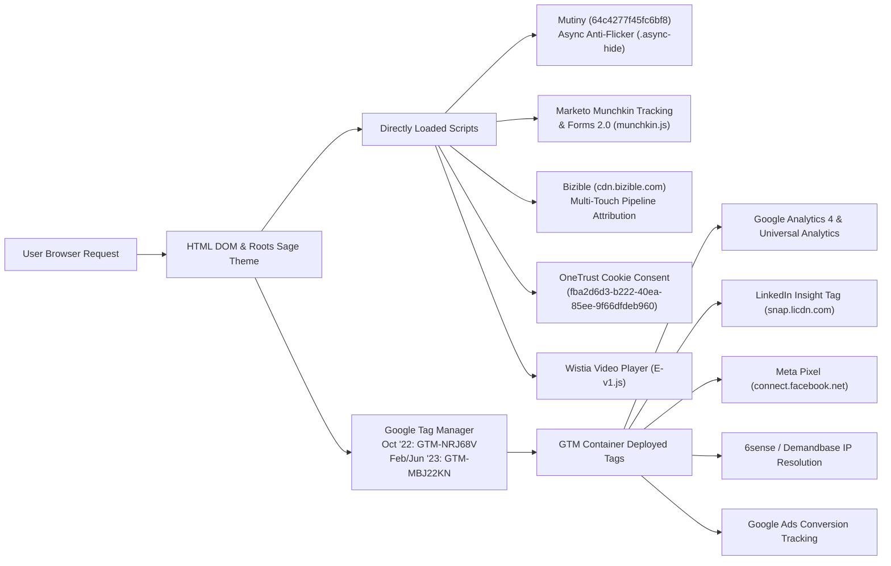

# Pendo Deep Technical Analysis: Content, Messaging, SEO, and Component Design System

**Scope:** Historical comparative analysis of Pendo.io across October 2022 (`20221022213729`), February 2023 (`20230209114429`), and June 2023 (`20230617214543`).  
**Purpose:** Technical artifact detailing audience personas, messaging evolution, technical SEO audit, GTM/MarTech tag mapping, and reverse-engineered modular component library.

---

## 1. Audience Persona Architecture & ICP Segmentation

The migration from October 2022 to February 2023 represented a fundamental transition in Pendo's Go-To-Market (GTM) posture: pivoting from a single-product tool into a **dual-engine enterprise platform**. The site architecture was intentionally segmented into two distinct persona categories:

### Detailed Persona Mapping Matrix

| Target Persona | Key Pain Points | IA Destination URL | Value Proposition & Messaging | Primary CTA |
| :--- | :--- | :--- | :--- | :--- |
| **Product Managers (PMs / CPOs)** | Feature blindspots, roadmapping friction, low feature adoption | `/product-experience/product-led-growth/` `/product/roadmap/` `/product/analytics/` | *"Software experiences for your customers"* — All-in-one product analytics, roadmaps, and feedback. | *Try Pendo Free* / *Tour the Product* |
| **UX & Product Designers** | Unclear user journeys, high drop-off during onboarding | `/product-experience/user-onboarding/` `/product-experience/user-experience/` | Streamline first-run experience, remove UI friction, deploy in-app guided walk-throughs. | *Tour the Product* |
| **Customer Support & CS Ops** | Repetitive support tickets, slow ticket resolution | `/product-experience/in-app-support/` `/product/in-app-guides/` | Deflect support volume with contextual in-app Resource Centers and automated guides. | *Schedule a Demo* |
| **Enterprise CIOs & IT Leaders** | SaaS sprawl, shadow IT, low employee software adoption | `/digital-adoption/saas-portfolio-management/` `/digital-adoption/governance-compliance/` | *"The digital workplace for your employees"* — Full visibility into internal software ROI and license usage. | *Schedule a Demo* |
| **HR & Change Management** | Employee resistance to new tools (e.g. Workday, Salesforce) | `/digital-adoption/change-management/` `/digital-adoption/employee-experience/` | Accelerate digital transformation and employee onboarding with in-app workflow training. | *Schedule a Demo* |
| **SaaS Procurement & Finance** | Wasted software spend on unused seats | `/product/saas-portfolio-insights/` `/products/saas-portfolio-insights/` | Uncover underutilized software licenses and benchmark usage across business units. | *Schedule a Demo* |

---

## 2. Content & Messaging Evolution Across Timestamps

### A. Homepage Headline & Narrative Shift
* **October 2022 (Legacy Monolith):**
  * **H1:** *"Software that makes your software better"*
  * **H2s:** *"Drive growth, efficiently"*, *"The Pendo Product Adoption Platform"*, *"Pendo helps you"*
  * **Positioning:** Generic product adoption message. Focused primarily on product teams without clear differentiation between external customer software and internal workplace tools.
* **February 2023 (Post-Migration Modular Platform):**
  * **H1 (Animated Multi-Pillar):** *"Why settle for just [analytics] / [in-app guides] / [feedback]?"*
  * **H2s (Bifurcated Persona Pillars):**
    1. *"Software experiences for your customers"* (Direct link to `/product/engage/`)
    2. *"The digital workplace for your employees"* (Direct link to `/product/adopt/`)
  * **Quantified KPI Social Proof:**
    * **`15%`** increase in user onboarding completion
    * **`30%`** reduction in customer support tickets
    * **`5%`** increase in feature adoption
  * **Positioning:** Direct competitive attack on single-point solutions (e.g., Mixpanel for analytics, WalkMe for guides, UserVoice for feedback) positioning Pendo as the unified, all-in-one platform.
* **June 2023 (Expansion & Data Ecosystem):**
  * **H1:** *"Software connects your product to the world"*
  * **H2 Additions:** *"Start improving software experiences for your customers"*, *"Start optimizing the digital workplace for your employees"*, *"Are you a startup?"*
  * **Positioning:** Introduction of the Pendo Data Sync ecosystem (`/products/data-sync/`) and segmented startup programs (`/pendo-free/`).

---

## 3. Technical SEO Scan & IA Structure

### A. Meta Data & Canonical Tag Comparison

| Element | October 2022 Capture | February 2023 Capture | June 2023 Capture |
| :--- | :--- | :--- | :--- |
| **Meta Title** | `Pendo.io - Product Experience and Digital Adoption Solutions` | `Pendo.io - Product Experience and Digital Adoption Solutions` | `Pendo.io - Product Experience and Digital Adoption Solutions` |
| **Meta Description** | `Pendo’s product experience and digital adoption solutions help companies become product-led and deliver digital experiences users love.` | `Pendo’s product experience and digital adoption solutions help companies become product led and deliver digital experiences users love.` | `Pendo’s product experience and digital adoption solutions help companies become product led and deliver digital experiences users love.` |
| **Canonical URL** | `https://www.pendo.io/` | `https://www.pendo.io/` | `https://www.pendo.io/` |
| **Heading Structure** | 1 x `<h1>`, 3 x `<h2>`, 8 x `<h3>` | 1 x `<h1>` (animated block), 5 x `<h2>`, 12 x `<h3>` | 1 x `<h1>`, 6 x `<h2>`, 14 x `<h3>` |

### B. Navigation & Footer Information Architecture Scan
* **Primary Navigation (`c-primary-nav` & `c-card-nav`):**
  * Migrated from a basic dropdown menu (`#megaMenu` with Foundation classes) to a multi-tiered mega-navigation featuring 2-column, 4-column, and split visual cards with iconography (`c-primary-nav__subnav--2col-2cards-split`).
  * Explicitly separated the top navigation into **"Products"** (Module and Suite hubs) and **"Use Cases"** (Persona-driven solution paths).
* **Footer Architecture (`c-footer`):**
  * Structured into a 5-column categorized hierarchy:
    1. **Products:** Analytics, In-app Guides, Feedback, Roadmapping, Mobile, SaaS Portfolio Insights.
    2. **Solutions:** Product Experience (Onboarding, Support, PLG), Digital Adoption (Change Mgmt, Employee Exp).
    3. **Resources:** Demo Center, Tour the Product, How I Pendo, Customer Stories, Pendo Neighborhood, Mind the Product.
    4. **Company:** Careers, About, News, Contact.
    5. **Legal & Compliance:** Privacy Policy, Terms of Service, OneTrust Cookie Preferences.

---

## 4. MarTech Stack & GTM Tag Cross-Reference

Cross-referencing direct DOM elements against Google Tag Manager container configurations across the migration:

### Detailed Script Mapping Table

| Script / Vendor | Load Method | Container / Key Identifier | Purpose & Event Triggers |
| :--- | :--- | :--- | :--- |
| **Mutiny** | Direct in `<head>` | `client/64c4277f45fc6bf8.js` | Real-time ABM website personalization; anti-flicker snippet hides unstyled content before variant injection. |
| **Marketo** | Direct in `<body>` | `munchkin.js` | Progressive profiling lead capture forms, lead scoring, and CRM synchronization. |
| **Bizible (Marketo Measure)** | Direct in `<head>` | `cdn.bizible.com/scripts/bizible.js` | **Added in Feb 2023:** Multi-touch marketing attribution linking page visits to Salesforce pipeline stages. |
| **Google Tag Manager** | Direct in `<head>`/`<body>` | `GTM-NRJ68V` (2022) &#8594; `GTM-MBJ22KN` (2023) | Central tag firing governance, dataLayer schema management, and analytics routing. |
| **OneTrust** | Direct in `<head>` | `data-domain-script="fba2d6d3..."` | GDPR/CCPA cookie banner management and script blocking. |
| **Wistia** | Async `<script>` / iframe | `fast.wistia.net/assets/external/E-v1.js` | Interactive video players for embedded product tours. |
| **Glide.js** | Theme Bundle Asset | `glide.min.js` & `glide.core.min.css` | Lightweight, dependency-free interactive sliders and tab switchers. |

---

## 5. Reverse-Engineered Modular Component Library

By analyzing classes, `data-*` attributes, ARIA roles, and DOM hierarchy across the Sage/Timber migration, we have reverse-engineered the exact modular component library built for the marketing platform:

### Component 1: Primary Navigation Mega-Menu (`c-primary-nav`)
* **HTML Element & Roles:** `<nav role="navigation" class="c-primary-nav">`
* **Class Patterns:**
  * `c-primary-nav__list`, `c-primary-nav__list-item`, `c-primary-nav__list-item-toggle`
  * `c-primary-nav__subnav--2col-2cards-split` (Two-column layout with split image promo cards)
  * `c-primary-nav__subnav--4col-wide-secondary` (Four-column category directory)
  * `c-primary-nav__subnav-item-icon`, `c-primary-nav__subnav-item-text`
* **Attributes & Tracking:** `data-label="nav-item-click"`, `data-track="primary-nav"`

### Component 2: Dynamic Headline & Animated Hero (`c-hero`)
* **HTML Element & Roles:** `<section role="banner" class="c-hero hero-animation">`
* **Class Patterns:**
  * `hero-heading`, `hero-text-animation`, `hero-left-image`
  * `inline-block`, `grid`, `grid-cols-1`
* **Interactive Attributes:** `data-fade="true"`, `data-fade-in-up="true"`, `data-prefix="Why settle for just"`

### Component 3: Dual-Persona Tabbed Carousel Switcher (`c-tab-carousel`)
* **HTML Element & Roles:** `
`
* **Class Patterns:**
  * `c-tab-nav`, `c-tab-button`, `c-tab-pane`, `c-card-nav`
  * `c-card-nav-item`, `c-card-nav-item__content`, `c-card-nav-item__media`
* **Attributes & Engine:**
  * Powered by **Glide.js**: `data-glide-el="track"`, `data-glide-dir="<"`, `data-glide-dir=">"`
  * State Toggling: `data-tab="customers"`, `data-tab-content="employees"`, `data-toggled="true"`

### Component 4: Quantified KPI Stats Grid (`c-stats-grid`)
* **HTML Element:** `<section class="c-stats-grid grid grid-cols-1 md:grid-cols-3">`
* **Class Patterns:**
  * `c-stat-card`, `c-stat-card__number`, `c-stat-card__label`, `c-stat-card__subtext`
* **Key Content Tokens:** `15%` (Onboarding), `30%` (Support Deflection), `5%` (Feature Adoption)

### Component 5: Reusable Split Content Block (`c-split-content`)
* **HTML Element:** `
`
* **Class Patterns:**
  * `c-split-content__media`, `c-split-content__copy`, `c-split-content__badge`
  * Layout variants: `c-split-content--reversed`, `c-split-content--dark`
* **Replaced Legacy:** Replaced hardcoded `component__content-2col--left-image` and `component__content-2col--right-image`.

### Component 6: Interactive Video Modal Overlay (`c-video-modal`)
* **HTML Element & Roles:** `
`
* **Class Patterns:**
  * `c-modal__backdrop`, `c-modal__container`, `c-modal__close-btn` (`#modal-close`)
* **Interactive Attributes:** `data-modal="video-tour"`, `data-toggled="false"`

### Component 7: Global Footer Directory (`c-footer`)
* **HTML Element & Roles:** `<footer role="contentinfo" class="c-footer">`
* **Class Patterns:**
  * `c-footer__grid`, `c-footer__col`, `c-footer__col-heading`, `c-footer__link-list`
  * `c-footer__legal-bar`, `c-footer__legal-links`, `c-footer__copyright`

---

## 6. Engineering & Organizational Constraints (Narrative Takeaways)

1. **Zero Downtime & SEO Equity Preservation:**
   * **Constraint:** The site maintained massive domain authority on existing solution paths (`/product-experience/*`, `/digital-adoption/*`).
   * **Solution:** Implemented a parallel taxonomy rather than a destructive site overhaul, routing legacy feature sub-paths (`/product/features/*`) via exact 301 redirect mappings while elevating core capabilities to 2-level hubs (`/product/{module}/`).
2. **CRO & Personalization Continuity:**
   * **Constraint:** Mutiny active personalization campaigns and Marketo progressive lead forms were actively driving inbound enterprise pipeline.
   * **Solution:** Maintained anti-flicker CSS snippets (`.async-hide`) and preserved standard form embed hooks during the Sage/Timber theme transition to prevent campaign interruption.
3. **Design System Fidelity & Component Modularity:**
   * **Constraint:** Marketing and design teams required pixel-perfect adherence to Figma design tokens with rapid turnarounds for new product launches.
   * **Solution:** Re-engineered the template layer into modern BEM component blocks (`c-primary-nav`, `c-tab-carousel`, `c-split-content`) in Roots Sage, enabling non-technical marketing ops to spin up new pages (such as `/products/data-sync/`) in minutes without creating engineering backlog tickets.
4. **Tag Governance & Compliance:**
   * **Constraint:** Strict global privacy compliance (GDPR/CCPA via OneTrust) and complex multi-touch attribution requirements (Bizible + GTM).
   * **Solution:** Successfully migrated the primary GTM container (`GTM-NRJ68V` &#8594; `GTM-MBJ22KN`) and integrated Bizible touchpoint instrumentation across all modular components.
