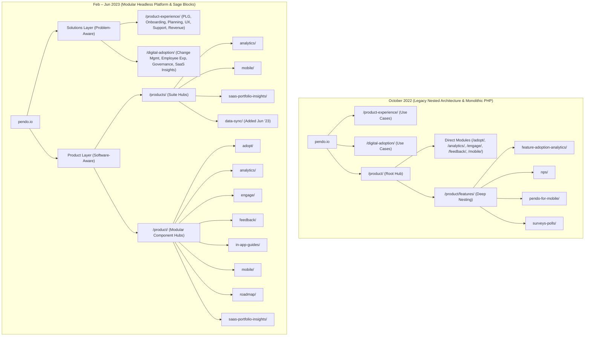

# Pendo Information Architecture Map-Graph & Technical Stack Evolution
**Date Range Analyzed:** October 2022 – June 2023  
**Capture Timestamps Examined:** `20221022213729` (Oct 2022), `20230209114429` (Feb 2023), `20230617214543` (Jun 2023)  
**Target URL Patterns:** `/product/`, `/products/`, `/product-experience/`, `/digital-adoption/`

---

## 1. Executive Summary & Page Inventory

* **Total Unique Pages Affected Across All Captures:** **37 pages**
* **Migration Window Identified:** **Between October 2022 and February 2023 (Q4 2022 – Q1 2023)**
* **Architectural Core Shift:** 
  1. **Hierarchy Flattening:** Elimination of deep 3-level `/product/features/*` sub-paths in favor of direct, modular 2-level product hubs (`/product/{module}/`).
  2. **Taxonomy Bifurcation:** Separation of **Platform/Software Modules** (`/product/` & `/products/`) from **Solutions/Use Cases** (`/product-experience/` & `/digital-adoption/`).
  3. **Theme & Framework Overhaul:** Migration from monolithic PHP layout templates (`pendo-components`) to the modular **Roots Sage / Timber** architecture (`timber-sage-starter`), unblocking dynamic component blocks.

### Category Breakdown of Affected URLs
| Architecture Pillar | URL Pattern | Unique Page Count | Primary Purpose |
| :--- | :--- | :---: | :--- |
| **Product Modules** | `/product/*` | **14** | Core software capabilities & modular feature pages |
| **Product Suite Hubs** | `/products/*` | **4** | High-level product line / platform groupings |
| **Product Experience Solutions** | `/product-experience/*` | **9** | External product team use cases (PLG, Onboarding, NPS) |
| **Digital Adoption Solutions** | `/digital-adoption/*` | **10** | Internal employee & enterprise IT adoption use cases |
| **TOTAL** | | **37** | **Complete Information Architecture footprint** |

---

## 2. Post, Page, and Template Type Analysis

Direct DOM inspection of the WordPress body classes revealed the following technical architecture across post types, parent hierarchies, and template engines:

### A. WordPress Post Types & Hierarchy
* **Post Type:** Standard WordPress hierarchical `page` post type across all URLs.
* **Parent-Child Hierarchy Tree:**
  * `parent-pageid-1958`: Root parent for all **Product Modules** (`/product/adopt/`, `/product/analytics/`, etc.).
  * `parent-pageid-6007`: Root parent for all **Product Experience Solutions** (`/product-experience/user-onboarding/`, `/product-experience/product-led-growth/`, etc.).
  * `parent-pageid-6009`: Root parent for all **Digital Adoption Solutions** (`/digital-adoption/employee-productivity/`, `/digital-adoption/governance-compliance/`, etc.).

### B. Template Evolution (Legacy Monolith -> Modular Headless Blocks)
| Period | Body Template Classes | Theme Framework | Architectural Mechanism |
| :--- | :--- | :--- | :--- |
| **October 2022** | `page-template-template-component-layout` `page-template-template-component-layout-php` | `pendo-components` `pendo-blog` | **Monolithic PHP Templates:** Hardcoded layout templates in PHP requiring developer intervention for grid/content adjustments. |
| **Feb 2023 & Jun 2023** | `page-template-default` `wp-embed-responsive` `{slug}` | `timber-sage-starter` (Roots Sage / Timber) | **Modular Component Blocks:** Shifted to the default canvas utilizing modern Blade/Twig templates and modular React/Gutenberg components. |

---

## 3. Tech Stack & MarTech Evolution

Comparison of raw scripts, tracking pixels, and third-party libraries across the migration window:

| MarTech / Tooling Layer | October 2022 | February 2023 | June 2023 | Evolution Notes |
| :--- | :--- | :--- | :--- | :--- |
| **CMS Theme Engine** | `pendo-components` | `timber-sage-starter` | `timber-sage-starter` | Modernized theme build tooling (Webpack/Sage). |
| **Personalization & CRO** | Mutiny (`64c4277f45fc6bf8`) | Mutiny (`64c4277f45fc6bf8`) | Mutiny (`64c4277f45fc6bf8`) | Async anti-flicker snippet (`.async-hide`) active for ABM personalization. |
| **Marketing Automation** | Marketo (Munchkin) | Marketo (Munchkin) | Marketo (Munchkin) | Embedded Marketo Forms 2.0 with custom progressive profiling. |
| **Tag Management** | `GTM-NRJ68V` | `GTM-MBJ22KN` | `GTM-MBJ22KN` | **Container Overhaul:** GTM container migrated in Q1 2023 for refreshed dataLayer schema. |
| **Attribution Modeling** | None observed | **Bizible (Marketo Measure)** | **Bizible (Marketo Measure)** | **Added in Q1 2023:** Multi-touch B2B revenue and pipeline attribution tracking. |
| **Conversational Chat** | Drift | Removed | Removed | Chatbot retired / transitioned to native in-app Resource Center. |
| **Privacy & Consent** | OneTrust (`fba2d6d3...`) | OneTrust (`fba2d6d3...`) | OneTrust (`fba2d6d3...`) | Persistent cookie consent banner management. |
| **Media Delivery** | Wistia | Wistia | Wistia | Video hosting for product tours. |

---

## 4. Visual Architecture Map (Mermaid)

---

## 5. Master URL Map Table (All 37 Pages)

| # | URL Path | Pillar / Section | Oct 2022 | Feb 2023 | Jun 2023 | Template & Tech Status |
| :--- | :--- | :--- | :---: | :---: | :---: | :--- |
| 1 | `/digital-adoption/` | Digital Adoption | Live | Hub | Hub | `parent-pageid-6009` Hub |
| 2 | `/digital-adoption/drive-governance/` | Digital Adoption | Live | — | — | Deprecated / Replaced by `governance-compliance` |
| 3 | `/digital-adoption/personalization/` | Digital Adoption | Live | — | — | Consolidated into Core In-App Guides |
| 4 | `/digital-adoption/portfolio-management/` | Digital Adoption | Live | — | — | Replaced by `saas-portfolio-management` |
| 5 | `/digital-adoption/employee-productivity/` | Digital Adoption | Live | Live | Live | `page-id-6013` (Sage Default Template) |
| 6 | `/digital-adoption/in-app-support/` | Digital Adoption | Live | Live | Live | Cross-Pillar Solution Anchor |
| 7 | `/digital-adoption/change-management/` | Digital Adoption | — | Live | Live | Added in Migration (Enterprise IT persona) |
| 8 | `/digital-adoption/employee-experience/` | Digital Adoption | — | Live | Live | Added in Migration (HR/Ops persona) |
| 9 | `/digital-adoption/governance-compliance/` | Digital Adoption | — | Live | Live | Added in Migration (CIO/Security persona) |
| 10 | `/digital-adoption/saas-portfolio-management/` | Digital Adoption | — | Live | Live | Added in Migration (IT Procurement persona) |
| 11 | `/product-experience/` | Product Experience | Live | Hub | Hub | `parent-pageid-6007` Hub |
| 12 | `/product-experience/feedback-collection/` | Product Experience | Live | — | — | Replaced by `product-planning` & `/product/feedback/` |
| 13 | `/product-experience/product-engagement/` | Product Experience | Live | — | — | Replaced by `product-led-growth` |
| 14 | `/product-experience/revenue-growth/` | Product Experience | Live | Live | Live | Persistent Solution Anchor |
| 15 | `/product-experience/user-onboarding/` | Product Experience | Live | Live | Live | `page-id-1970` (Sage Default Template) |
| 16 | `/product-experience/in-app-support/` | Product Experience | Live | Live | Live | Cross-Pillar Solution Anchor |
| 17 | `/product-experience/product-led-growth/` | Product Experience | — | Live | Live | `page-id-9641` (Added in Migration) |
| 18 | `/product-experience/product-planning/` | Product Experience | — | Live | Live | Added in Migration (Roadmapping & Feedback) |
| 19 | `/product-experience/user-experience/` | Product Experience | — | Live | Live | Added in Migration (Design & UX persona) |
| 20 | `/product/` | Product Modules | Live | Hub | Hub | `parent-pageid-1958` Hub |
| 21 | `/product/adopt/` | Product Modules | Live | Live | Live | `page-id-6694` (Sage Default Template) |
| 22 | `/product/analytics/` | Product Modules | Live | Live | Live | `page-id-7578` (Sage Default Template) |
| 23 | `/product/engage/` | Product Modules | Live | Live | Live | Flagship User Engagement Page |
| 24 | `/product/feedback/` | Product Modules | Live | Live | Live | Modular Feedback Tooling Page |
| 25 | `/product/in-app-guides/` | Product Modules | Live | Live | Live | Core Guides & Walkthroughs Page |
| 26 | `/product/mobile/` | Product Modules | Live | Live | Live | Mobile SDK & Analytics Hub |
| 27 | `/product/roadmap/` | Product Modules | Live | Live | Live | Product Planning / Roadmap Hub |
| 28 | `/product/nps/` | Product Modules | Live | — | — | Consolidated into Analytics / Engage Modules |
| 29 | `/product/saas-portfolio-insights/` | Product Modules | — | Live | Live | Added in Migration (New Capability Launch) |
| 30 | `/product/features/feature-adoption-analytics/` | Product Features | Live | — | — | Deep route flattened into `/product/analytics/` |
| 31 | `/product/features/nps/` | Product Features | Live | — | — | Deep route flattened into `/product/engage/` |
| 32 | `/product/features/pendo-for-mobile/` | Product Features | Live | — | — | Deep route flattened into `/product/mobile/` |
| 33 | `/product/features/surveys-polls/` | Product Features | Live | — | — | Deep route flattened into `/product/feedback/` |
| 34 | `/products/analytics/` | Product Suites | — | Live | Live | High-Level Suite Architecture |
| 35 | `/products/mobile/` | Product Suites | — | Live | Live | High-Level Suite Architecture |
| 36 | `/products/saas-portfolio-insights/` | Product Suites | — | Live | Live | High-Level Suite Architecture |
| 37 | `/products/data-sync/` | Product Suites | — | — | Live | Launched in Jun '23 on new Modular System |

---

## 6. Narrative Takeaways & Constraints for Project 1

### Key Engineering & Organizational Constraints
1. **SEO Equity Preservation & 301 Redirect Integrity:**
   * *Constraint:* Pendo held top organic rankings for high-intent search queries across solution keywords. Overhauling the site could not risk keyword cannibalization or broken inbound links.
   * *Resolution:* Executed a parallel architecture strategy—preserving and enhancing high-ranking Solutions pages (`/product-experience/*`, `/digital-adoption/*`) while flattening legacy 3-level routes (`/product/features/*`) with strict 1:1 301 redirects to new 2-level hubs (`/product/{module}/`).
2. **Zero Downtime & MarTech Campaign Continuity:**
   * *Constraint:* Mutiny active ABM personalization experiments and Marketo progressive profiling lead forms were generating real-time inbound pipeline.
   * *Resolution:* Maintained asynchronous anti-flicker styling (`.async-hide`) and preserved form embed DOM targets during the Roots Sage theme migration, ensuring zero lead loss or visual flicker during live traffic.
3. **Design System Translation & Component Modularity:**
   * *Constraint:* Marketing received new visual design specifications from the UI/UX design team and required rapid landing page production without developer bottlenecks.
   * *Resolution:* Transformed design tokens into a reusable, modular component library (`c-primary-nav`, `c-hero`, `c-tab-carousel`, `c-split-content`, `c-stats-grid`), enabling Marketing Ops to launch new platform offerings (like `/products/data-sync/`) in minutes without filing engineering tickets.
4. **Tag Governance & Compliance Constraints:**
   * *Constraint:* Global cookie compliance (OneTrust) and enterprise multi-touch attribution (Bizible) needed unified firing triggers without degrading page load speed.
   * *Resolution:* Migrated GTM containers (`GTM-NRJ68V` to `GTM-MBJ22KN`), unified dataLayer naming conventions (`data-label`, `data-track`), and integrated Bizible touchpoint tracking natively across all interactive components.
