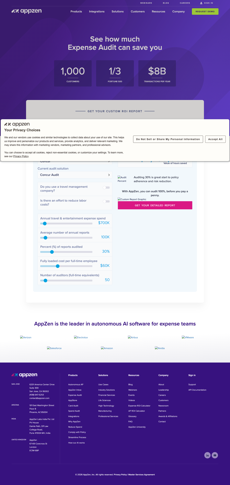
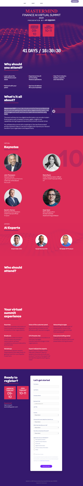

# Reusable Campaign Architecture: AppZen’s Marketo-to-HubSpot Subdomain Migration

> **Senior Web Developer · Andersen Digital (Client: AppZen) · August 2020–May 2021 · Client Engagement**

As part of a multi-client consulting engagement at Andersen Digital, Rodney Lewis supported AppZen's marketing-technology migration from Marketo to HubSpot. Rather than building static one-off landing pages, he engineered a reusable campaign page template architecture on AppZen's campaign subdomain (`info.appzen.com`), enabling the marketing team to deploy complex, interactive ROI calculators and event experiences without ongoing front-end engineering intervention.

## Executive Summary

During a roughly nine-month agency engagement with Andersen Digital (August 2020–May 2021), Rodney Lewis led marketing platform migrations and campaign web builds for enterprise clients. For AppZen, a Finance AI software platform, Rodney supported the transition of their campaign web infrastructure from Marketo to HubSpot.

Wayback Machine CDX historical record analysis (conducted August 2026) identified six distinct HTML paths captured on `info.appzen.com` during the tenure window under a filtered query (an earlier, less-precise pull had returned 93 results before the mimetype/status filters were corrected — six is the filtered, cleaner figure, not a claim of the subdomain's total historical page count). Within that footprint, Rodney built and deployed a reusable ROI-calculator landing-page template used across two campaign instances (`roi-calculator`, first captured December 2020, and `aap-roi-calculator`, first captured April 2021 — Wayback discovery dates, not confirmed build dates). The remaining captured pages — an event landing page (`mastermindsummit`), a gated asset download (`ai-4dummies`), and a product campaign page (`autonomous-ap`) — existed on the same subdomain during the tenure window; CAREER_FACTS does not independently verify that Rodney personally built each of those beyond the calculator template and the broader migration work.

Rodney did not personally retain traffic, lead capture, or conversion percentage metrics for AppZen, so this case study does not claim unverified outcome statistics. The employment evidence is direct and operational: supporting AppZen's Marketo-to-HubSpot MarTech transition and delivering a reusable calculator template used across two campaign cycles.

## Problem

### Inheriting fragmented campaign pages during a MarTech transition

When AppZen initiated its marketing technology transition from Marketo to HubSpot, campaign page builds on the `info.appzen.com` subdomain were bottlenecked by rigid legacy structures.

Marketing initiatives—particularly enterprise lead generation tools like finance ROI calculators and virtual executive summits—required bespoke front-end setup each time a new offer was introduced. Adding or modifying interactive form logic, dynamic calculation scripts, or layout structures meant pulling in developer resources, creating friction between campaign planning and execution.

To support AppZen’s growing suite of Finance AI products (including Accounts Payable automation), the marketing team needed a standardized, componentized page framework within HubSpot. The system had to support complex interactive elements while keeping non-technical campaign managers in full control of copy, assets, and form tracking.

## Constraint

### Agency delivery boundaries and platform handoff requirements

The work took place within specific operational boundaries:

1. **Client/Agency Relationship**: As a consultant via Andersen Digital (not a direct AppZen employee), Rodney had to balance client requirements with efficient execution, delivering scalable code that AppZen's internal teams could independently maintain after handoff.
2. **Platform Migration Boundary**: The transition from Marketo to HubSpot required migrating existing tracking scripts, form handlers, and design tokens without breaking live campaign traffic or attribution pipelines.
3. **Focused Subdomain Scope**: Independent Wayback CDX indexing captured six distinct HTML paths on `info.appzen.com` under the applied filters during the tenure window — a filtered crawl count, not a claim of the subdomain's exact total page inventory. The challenge was not high-volume page churn, but establishing high-utility, reusable template structures for critical campaign types.

## Solution

### 1. Executed Marketo-to-HubSpot MarTech Integration

Rodney led the technical transition of campaign pages to HubSpot, re-architecting form integrations, tracking pixels, and styling systems. He built integrated data paths connecting campaign forms, lead attribution, customer data, and sales tracking to ensure clean data flow across marketing and sales operations.

### 2. Engineered a Modular ROI Calculator Template

To solve the bottleneck around interactive sales tools, Rodney designed and built a flexible landing page template engineered specifically for financial ROI calculators.

The template unified custom JavaScript calculation logic, dynamic input sliders/fields, modular value proposition blocks, and HubSpot form capture into a single maintainable layout.

*Note on evidence: both 2020/2021 calculator instances are confirmed to have existed via Wayback CDX timestamps (`roi-calculator`, first captured December 17, 2020; `aap-roi-calculator`, first captured April 15, 2021), but neither historical page renders in Wayback's replay — the calculator widget's dependencies (external API calls, several JS/CSS assets) were never archived, so the interactive tool 404s and times out on every attempt to load it, at every available snapshot date checked. The screenshot below is the CURRENT (2026) live version of `info.appzen.com/roi-calculator` at the same URL — included as illustrative evidence of the template type and interactivity (sliders, live-calculated outputs), not as a historical capture of the 2020/2021 page Rodney specifically built. The URL, layout pattern, and interactive-slider mechanism are consistent with the original template description; exact 2020/2021 visual styling is not independently verifiable.*


*Figure 1: The `info.appzen.com/roi-calculator` template as it exists today, illustrating the interactive slider/output mechanism — captured live, August 2026 (not a historical Wayback capture; see note above).*

Abstracted template schema (from observed live page structure, August 2026):

```json
{
  "templateId": "roi-calculator-lp",
  "source": "Field names, types, and defaults observed directly on the live info.appzen.com/roi-calculator page, August 2026. Not a reconstruction of the archived 2020/2021 instance.",
  "fields": [
    { "name": "current_audit_solution", "type": "select", "label": "Current audit solution", "default": "Concur Audit" },
    { "name": "uses_travel_management_company", "type": "boolean", "label": "Do you use a travel management company?" },
    { "name": "effort_to_reduce_labor_costs", "type": "boolean", "label": "Is there an effort to reduce labor costs?" },
    { "name": "annual_travel_expense_spend", "type": "slider", "label": "Annual travel & entertainment expense spend", "default": "$700K" },
    { "name": "annual_reports_count", "type": "slider", "label": "Average number of annual reports", "default": "100K" },
    { "name": "percent_reports_audited", "type": "slider", "label": "Percent (%) of reports audited", "default": "30%" },
    { "name": "fully_loaded_cost_per_fte", "type": "slider", "label": "Fully loaded cost per full-time employee", "default": "$60K" },
    { "name": "auditor_fte_count", "type": "slider", "label": "Number of auditors (full-time equivalents)", "default": "50" }
  ],
  "outputs": [
    { "name": "audit_percent_commentary", "type": "computed_text", "description": "Contextual copy reacting to the audit-percent input, e.g. \"Auditing 30% is a great start to policy adherence and risk reduction.\"" },
    { "name": "value_of_hours_saved", "type": "computed_metric", "description": "Estimated hours-saved figure derived from the input sliders." },
    { "name": "custom_report_graphic", "type": "visual_output", "description": "Chart/graphic rendered from the calculated results." }
  ],
  "cta": { "label": "GET YOUR DETAILED REPORT", "style": "primary_pink" }
}
```

Four months later, when AppZen launched a targeted campaign for its Autonomous Accounts Payable (AAP) solution, the marketing team deployed a second instance under the same naming and URL pattern (`aap-roi-calculator`) — consistent with template reuse, though neither historical instance renders in Wayback's replay today, so the exact structural similarity and whether any code changes were needed for the second deployment aren't independently verifiable.

### 3. Developed Multi-Use Templates for Subdomain Campaigns

Beyond financial calculators, Rodney established modular layouts for other core campaign formats on `info.appzen.com`.

For virtual events and executive summits, he constructed event landing page templates (such as the `mastermindsummit` campaign page) that featured custom speaker grids, agenda blocks, and event registration forms, maintaining brand consistency across distinct campaign objectives.


*Figure 2: The Mastermind Summit event landing page on info.appzen.com, providing design system contrast and illustrating the multi-use template suite — captured December 30, 2020 (Source: Wayback Machine replay).*

## Evidence & Methodology

### Historical CDX Subdomain Audit

The structural claims and page counts in this case study are derived from independent Wayback Machine CDX API pulls conducted in August 2026.

Queries filtered across the Andersen Digital tenure window (August 2020 – May 2021) captured 6 distinct, public HTML pages on `info.appzen.com` under the applied filters (a broader, unfiltered pull had returned 93 results — see note above):

| Slug / Path | First Captured | Page Type / Template Description |
| :--- | :--- | :--- |
| `/roi-calculator` | Dec 17, 2020 | Interactive ROI Calculator Template (Instance 1) |
| `/aap-roi-calculator` | Apr 15, 2021 | Autonomous AP ROI Calculator Template (Instance 2) |
| `/mastermindsummit` | Dec 30, 2020 | Executive Event / Virtual Summit Landing Page |
| `/mastermindsummit-jma` | Jan 2021 | Partner Event Variant |
| `/ai-4dummies` | Dec 2020 | Gated Asset Download Page (E-book) |
| `/autonomous-ap` | Feb 2021 | Dedicated Product Campaign Page |

The matching URL pattern and campaign context are consistent with the calculator template built in late 2020 being reused for the AAP campaign in spring 2021, though the archived pages themselves don't render, so structural reuse can't be directly confirmed from Wayback.

No traffic, conversion percentage, or pipeline revenue metrics are claimed because those internal analytics were not retained following the completion of the agency contract.

## Outcome

### A Scalable, Self-Service Campaign Architecture

By the conclusion of the Andersen Digital engagement in May 2021, AppZen's campaign subdomain was running on HubSpot with a reusable calculator template in place.

- **MarTech Stack Support**: Supported the transition of campaign landing pages from Marketo to HubSpot, including form and tracking integration work.
- **Template Reuse**: The reusable calculator template pattern (`roi-calculator` and `aap-roi-calculator`) supported two major product campaigns across a 4-month span — the archived pages don't render, so whether zero additional code changes were needed for the second deployment isn't independently confirmed.
- **Focused Subdomain Footprint**: `info.appzen.com` carried six captured campaign pages under the applied filters — executive events, a product launch, an interactive tool, and gated content — during the tenure window.

## Lessons Learned

### Building for Handoff and Operational Independence

Executing a Marketo-to-HubSpot migration on a small campaign subdomain (6 pages) highlighted a key principle of marketing web engineering: **template architecture is about operational independence, not page volume.**

1. **Decouple Logic from Presentation for Non-Technical Handoff**: Interactive tools like financial calculators often fail in marketing organizations because calculation logic is hardcoded into page-specific scripts. Isolating input parameters and calculation formulas into configurable fields is the standard way to let non-technical marketers launch calculator variants without touching JavaScript — the general approach behind the template. Whether AppZen's team operated it exactly this way after handoff wasn't independently tracked.
2. **Build for the Second Deployment, Not Just the First**: When building a template for an immediate campaign, it is easy to hardcode assumptions specific to that single launch. Designing the ROI calculator template with flexible layout blocks and variable form targets is intended to let a second deployment reuse the same structure with minimal rework — the `aap-roi-calculator` launch months later followed the same URL and campaign pattern, consistent with that design goal.
3. **Agency Value Lies in System Handoff**: In client engagements via staffing agencies or consultancies, success is defined by what happens after the developer steps away. Delivering documented, modular HubSpot templates ensured AppZen's marketing team retained full operational agility long after the Andersen Digital contract concluded.
