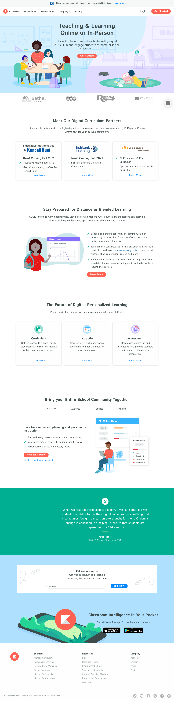

# One Owner, 40+ React Components, and New Lead-Gen Infrastructure

> **Senior Web Developer · Kiddom · April–September 2021 · Contract (Sole Marketing Site Developer)**
>
> *Correction (August 11, 2026): an earlier draft of this case study claimed a ~44% URL "consolidation" based on a raw Wayback crawl-footprint count. That figure was wrong — it measured what an automated crawler happened to discover, not the site's actual structure. Rodney's own declared `sitemap.xml` (the authoritative source) shows the opposite: the site grew from 51 to 54 URLs, with zero pages removed. This version reflects the corrected, verified record.*

As the sole developer on Kiddom's marketing website during a six-month engagement, Rodney Lewis owned the full lifecycle of front-end engineering, performance diagnostics, and site architecture. Operating on a custom Gatsby (React) stack, he built 40+ reusable React components while expanding the site's lead-gen and content infrastructure — adding a `/customer-stories/` section, a `/grant-match/` lead-capture page, and a new content asset — all while keeping `sitemap.xml` clean and fully crawled.

---

## Problem

### Unstandardized front-end components and no dedicated technical owner

When Rodney joined Kiddom as a contract Senior Web Developer in April 2021, the K-12 education technology provider's marketing site (51 URLs per its declared sitemap) faced two operational challenges:

1. **Lack of Reusable Component Architecture**: Front-end sections had been built as static, one-off layouts. Launching new campaign pages or addressing page speed issues required repetitive coding rather than assembling standardized, modular components.
2. **Diagnostic Disconnect**: Technical performance bottlenecks (Lighthouse scores) and visitor drop-off points (heatmap and funnel friction) were visible in analytics, but lacked a dedicated developer to translate those diagnostic signals into front-end solutions.


*Figure 1: Kiddom homepage at the start of the tenure window — source: [Wayback Machine (March 30, 2021)](http://web.archive.org/web/20210330191511/https://www.kiddom.co/).*

---

## Constraint

### Sole-developer ownership under a performance-contingent contract

The parameters of the Kiddom engagement created tight operational boundaries:

- **Sole Marketing Site Developer**: Rodney was the only developer assigned to the marketing website. Every diagnostic audit, React component architecture decision, code update, quality assurance test, and deployment rested entirely on him.
- **Static Gatsby Stack Constraints**: The site ran on static Gatsby (React)—independently verified via archived page source showing Gatsby's `#___gatsby` mount point and `component---` Webpack chunk bundles. With no tag manager (GTM) or heavy CMS plugin layer present, all tracking and component enhancements required clean, repository-level JavaScript and CSS.
- **Sitemap & Search Integrity**: Any new section added to the site had to be executed carefully to protect indexed content, maintain `sitemap.xml` integrity, and avoid disrupting existing traffic for active district prospects.
- **Performance-Contingent Scope**: The contract was explicitly tied to performance and impact. Extension of the engagement depended directly on demonstrating tangible progress in front-end quality, delivery velocity, and site health.

---

## Solution

### Diagnostic prioritization, 40+ Gatsby components, and new lead-gen infrastructure

Rodney executed a systematic, end-to-end upgrade of Kiddom's web platform across three core pillars:

### 1. Reusable React Component Foundation
Rodney built and deployed **40+ reusable React components in Gatsby**, establishing a modular visual and functional system across the codebase. By standardizing component interfaces, he enabled faster page assembly, consistent visual styling, and cleaner code splitting via Webpack chunking.

### 2. Multi-Signal Diagnostic Workflow
Using a combination of **Lighthouse performance runs, funnel analysis, heatmaps, conversion tracking, and technical diagnostics**, Rodney identified high-friction user paths and performance bottlenecks. He translated behavioral data (where users struggled or dropped off) and technical data (render-blocking assets, layout shifts) directly into prioritized code fixes.

### 3. New Lead-Gen and Content Infrastructure, Sitemap Integrity Maintained
Working through the URL inventory, Rodney built new sections to elevate core marketing priorities without touching what already worked:
- **Added a Customer Proof Section**: Built a new `/customer-stories/` section alongside the existing `/success-stories/` pages — additive, not a replacement.
- **Added Targeted Campaign Assets**: Built out a dedicated `/grant-match/` section to capture high-intent funding interest from K-12 administrators.
- **Added a Content Asset**: Shipped a new `/resources/state-of-digital-curriculum-report-2021/` page.
- **Maintained Sitemap Discipline**: Ensured `sitemap.xml` remained active and continuously crawled throughout, with every pre-existing page — including older sections like `/alternative/`, `/brain-trust/`, `/partnerships/`, and `/gdpr/` — still present and indexed at tenure end.

```json
{
  "note": "Before/after sitemap.xml diff, kiddom.co, confirmed via direct Wayback Machine capture (August 11, 2026)",
  "pre_tenure": {
    "source": "http://web.archive.org/web/20210326051404/https://www.kiddom.co/sitemap.xml",
    "captured": "2021-03-26",
    "url_count": 51
  },
  "post_tenure": {
    "source": "http://web.archive.org/web/20210825203849/https://www.kiddom.co/sitemap.xml",
    "captured": "2021-08-25",
    "url_count": 54
  },
  "diff": {
    "removed": [],
    "added": [
      "https://www.kiddom.co/customer-stories/",
      "https://www.kiddom.co/grant-match/",
      "https://www.kiddom.co/resources/state-of-digital-curriculum-report-2021/"
    ]
  }
}
```


*Figure 2: Kiddom marketing site at the end of the 6-month contract tenure — source: [Wayback Machine (September 27, 2021)](http://web.archive.org/web/20210927010005/https://www.kiddom.co/).*

---

## Results

### An expanded architecture, robust codebase, and contract renewal

Wayback Machine sitemap.xml records and corroborated career records document the impact of Rodney's six months as sole developer:

- **Sitemap Growth, Zero Removals**: The declared sitemap moved from **51 URLs before tenure** to **54 URLs by tenure end**, adding new lead-gen and content infrastructure (`/customer-stories/`, `/grant-match/`, a new resources page) with nothing removed.
- **40+ React Components Shipped**: Established a durable, reusable component library in Gatsby that improved front-end quality and streamlined ongoing updates.
- **Unbroken MarTech Continuity**: Maintained clean integration of baseline analytics (Google Analytics `UA-56699393-1` and Bing UET) across the entire architectural transition.
- **Performance-Contingent Renewal**: Based on the technical quality of the delivery, site improvements, and developer execution, Kiddom renewed and extended Rodney's contract. (Per strict evidence standards, no unverified organic traffic or conversion percentages are claimed; contract continuation serves as the verified proof of impact).

---

## Lessons Learned

### Insights from sole ownership of a static marketing platform

Operating as the sole developer on a live B2B SaaS marketing site yielded distinct engineering and operational insights:

1. **Sole Ownership Demands Complete Technical Discipline**
   When you are the only developer on a site, there is no separate QA team or devops layer to catch mistakes. Owning everything from Lighthouse scores down to Webpack chunking forces strict habits: component code must be clean, self-documenting, and resilient. Diagnosing funnel friction alongside code bugs builds a direct connection between front-end architecture and user behavior.

2. **Growing a Site Without Disturbing What Already Ranks**
   Adding new sections is easy; adding them without disturbing indexed, already-ranking pages is not. Building `/customer-stories/` alongside the existing `/success-stories/` pages — rather than replacing them outright — taught Rodney that expansion should be paired with active sitemap verification (`sitemap.xml`) and a bias toward addition over risky wholesale restructuring, especially on a site with no dedicated SEO team to catch a mistake.

3. **Static Stacks Reward Lean Component Design**
   In a Jamstack/Gatsby environment without heavy CMS plugins, site speed and component flexibility depend entirely on code quality. Building 40+ components demonstrated that a well-designed modular React system not only accelerates development velocity but keeps static builds lightweight, fast, and easy to maintain long after the contract ends.
