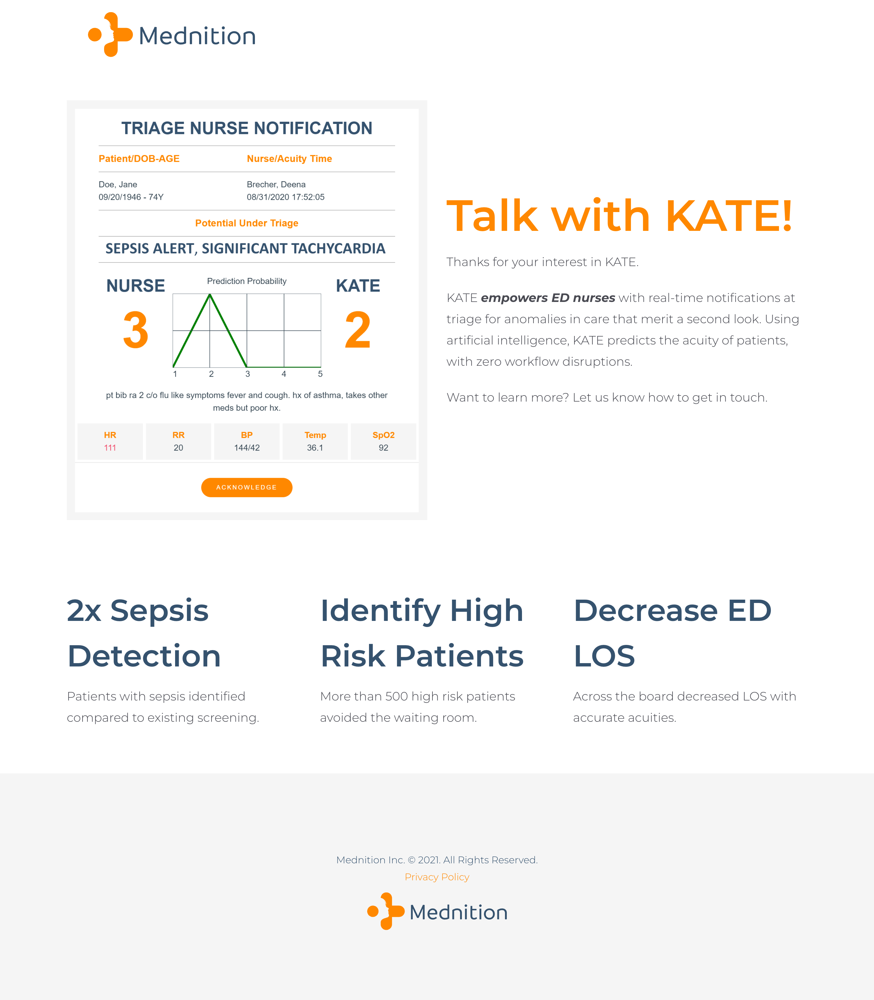
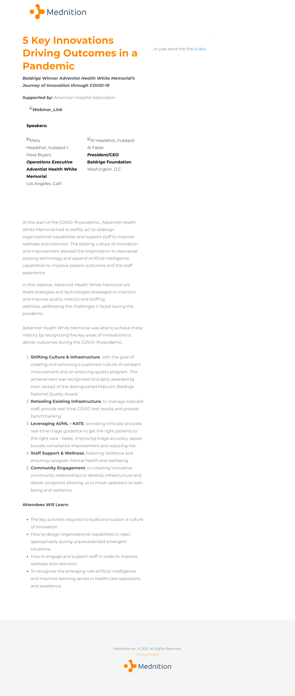
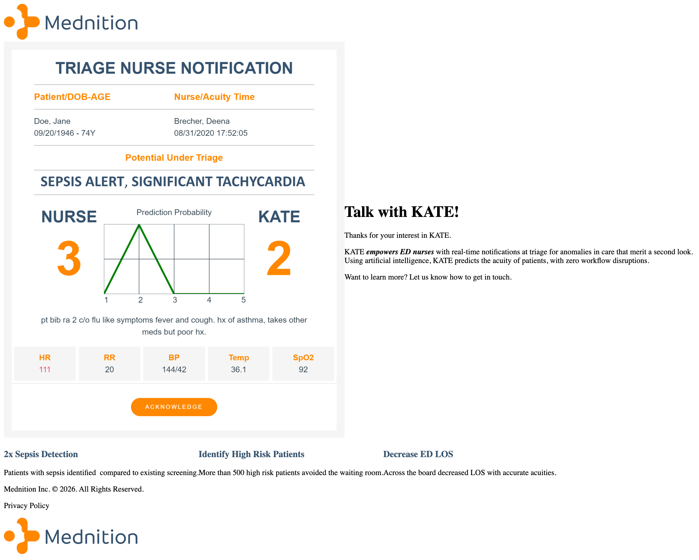

# Built to Last: High-Durability HubSpot Templates for Emergency Healthcare AI

> **HubSpot Developer / Designer · Mednition · February–July 2021 · Contract**

When Rodney Lewis took on a contract with Mednition—an emergency department healthcare AI platform—the original posting scoped a **1–2 week micro-engagement (5–8 hours per week)** to design and develop up to 3 landing pages in HubSpot with conversion optimization. The scope was extended to **five months**, during which Rodney built landing page templates — one of which, per Wayback, remained in **live production use for nearly five years**.

*Figure 1: Mednition's 'KATE for ESI Acuity Assignment' landing page as first captured by the Wayback Machine — [February 27, 2021](http://web.archive.org/web/20210227064056/https://insights.mednition.com/kate-for-esi-acuity-assignment) (crawler discovery date, not a confirmed launch date).*

## Executive Summary

A short 2021 contract evolved into long-term infrastructure. Rodney served as HubSpot Developer / Designer for Mednition from February through July 2021, designing and developing landing pages on Mednition's `insights.mednition.com` subdomain for KATE, their AI-powered decision-support solution for emergency department triage acuity assignment.

The engagement began with a tight mandate: 1–2 weeks to design and develop up to 3 landing page templates with A/B testing for higher conversion. As Rodney built clean, modular HubSpot templates that marketing could operate without technical friction, Mednition expanded the contract to five months. Rodney delivered five confirmed landing pages across distinct campaign types: `kate-for-esi-acuity-assignment`, `aha-innovation-event`, `emergency-department-esi-triage-research-study`, `esi-kate-demo`, and `demo`.

The strongest proof of the work's impact is its durability. Independent Wayback Machine records verify that the `kate-for-esi-acuity-assignment` page Rodney built in early 2021 was **still being crawled in production as of February 2026** — nearly five years of continuous capture for a contract initially scoped for 1–2 weeks. Separately, Wayback CDX records show **33 distinct URL paths** captured on `insights.mednition.com` between 2021 and 2026 (18 in 2023, 16 in 2025), confirming the subdomain itself stayed in active, growing use for years after the contract ended — that count is evidence of sustained subdomain activity, not proof that every one of those 33 pages used Rodney's specific templates.

Rodney did not personally track underlying A/B test conversion percentages or lead volumes, so this case study does not report invented outcome metrics. The impact is demonstrated directly through contract extension and nearly five years of verified production utility for at least one page he built.

## Context

### A micro-contract extended through execution

Rodney joined Mednition through Creative Circle in February 2021. Mednition’s flagship solution, **KATE**, uses artificial intelligence to assist emergency department nurses with Emergency Severity Index (ESI) triage acuity assignment—helping clinicians catch high-risk patients earlier and reduce triage errors in fast-paced ER environments.

The project began under narrow parameters:
- **Original scope:** 1–2 weeks at 5–8 hours per week.
- **Objective:** Design and develop up to 3 landing pages/templates in HubSpot for higher conversion, with A/B testing.
- **Subdomain:** `insights.mednition.com` (Mednition’s dedicated HubSpot marketing instance).

The engagement was subsequently extended through July 2021 (a five-month total tenure) — a scope expansion consistent with client satisfaction, though no contract record specifies the exact reason. During this period, Rodney balanced Mednition alongside concurrent contract commitments at Andersen Digital, e.l.f. Cosmetics, and Kiddom—making rapid execution and zero-friction handoff essential.

## Starting State

### Healthcare AI messaging in need of structured web delivery

Before the contract, Mednition needed dedicated campaign landing pages to reach hospital executives, clinical directors, and emergency department nurse leaders. Selling AI into clinical environments carries specific challenges:
1. **High trust threshold:** Healthcare decision-makers reject aggressive B2B SaaS tactics. The design must communicate clinical precision, research backing, and operational safety.
2. **Diverse campaign entry points:** The company needed pages for direct product demos, clinical research studies, and major industry events (such as the American Heart Association Innovation Event).
3. **Template dependency:** Without clean, reusable templates in HubSpot, launching a new campaign meant custom coding or wrestling with rigid, broken layouts.

The starting mandate was to replace one-off page creation with a structured landing page system inside HubSpot that could support A/B testing and rapid campaign assembly.

## What Rodney Did

### 1. Designed and built modular HubSpot landing page templates

Rodney deconstructed Mednition’s messaging into reusable visual containers inside HubSpot. He established clean typography, clear visual hierarchy, scannable feature blocks, and clear call-to-action (CTA) paths tailored for healthcare leadership.

Per Rodney's direct account, he designed and built five landing pages on `insights.mednition.com`; two are independently corroborated by Wayback archive captures (the other three were never crawled — common for gated or unlinked LPs, so their absence from the archive is not evidence against them, but they rest on direct account rather than archive proof):
- `kate-for-esi-acuity-assignment`: The primary solution page explaining KATE's role in Emergency Severity Index triage assignment.
- `aha-innovation-event`: A specialized event landing page for the American Heart Association Innovation Event.
- `emergency-department-esi-triage-research-study`: A clinical research landing page targeting ER study participants.
- `esi-kate-demo`: A direct demo request page focused on ESI acuity workflows.
- `demo`: A streamlined conversion portal for inbound campaign traffic.

*Figure 2: The AHA Innovation Event landing page built on the same modular template system — [Wayback Machine, February 27, 2021](http://web.archive.org/web/20210227055503/https://insights.mednition.com/aha-innovation-event).*

### 2. Built for non-technical marketing operation

Rodney configured the HubSpot templates with strict content boundaries, separating visual styling and layout logic from content fields — the standard approach for enabling non-technical marketing teams to update copy and launch new campaign variants without engineering involvement. (Mednition's actual day-to-day publishing workflow after handoff was not independently observed or tracked.)

### 3. Executed within a performance-contingent contract model

The role included setting up A/B testing for conversion rate optimization per the original project scope. The client extended the contract from the initial 1–2 week window up to a full five months — timing consistent with satisfaction with the delivery, though the specific reason for extension isn't independently documented.

## Evidence & Methodology

### Near-5-year production durability verified via Wayback Machine

The durability claims in this case study were independently audited in **August 2026** using the Internet Archive’s Wayback Machine CDX API.

*Figure 3: The same landing page, still live and being crawled nearly 5 years later — [Wayback Machine, February 9, 2026](http://web.archive.org/web/20260209234441/https://insights.mednition.com/kate-for-esi-acuity-assignment).*

The archived record confirms:
1. **Contemporaneous discovery:** `kate-for-esi-acuity-assignment` and `aha-innovation-event` were first captured on **February 27, 2021**, right at the start of Rodney's tenure — consistent with (though not independent proof of) creation during this engagement, since a Wayback first-capture date reflects when the crawler found the page, not necessarily when it was built.
2. **Near-5-year production longevity:** `kate-for-esi-acuity-assignment` was captured continuously from **February 27, 2021 through February 9, 2026** — roughly 4.9 years. Comparing Figure 1 (2021) and Figure 3 (2026), the page's core content, form structure, and general layout skeleton persisted in live production half a decade later; the 2026 capture shows some typography/spacing differences from 2021, which may reflect a later refresh or a Wayback asset-replay artifact rather than an exact-pixel match — the claim here is content and structural persistence, not unchanged visual fidelity.
3. **Subdomain footprint:** `insights.mednition.com` shows **33 distinct URL paths** captured from 2021 through 2026 — including 18 paths captured in 2023 and 16 in 2025/2026. This demonstrates the HubSpot instance stayed the active publishing hub for Mednition's marketing operations long after the contract concluded; it does not by itself show that all 33 pages used Rodney's specific template architecture, since most were not classified against the five pages he built.

### Evidence discipline

Rodney did not personally log or retain Mednition’s internal HubSpot analytics or A/B test conversion numbers. In accordance with strict career fact verification rules:
- **No invented percentages:** No claim is made regarding conversion rate lift, click-through rates, or lead volume.
- **Verifiable facts only:** Impact is documented through contract scope extension (1–2 weeks extended to 5 months) and independent, nearly-5-year public archive verification.

## Outcome

### Long-term utility from a short contract

Rodney delivered a landing page template system that exceeded its initial scope in both tenure and lifespan:
- **Scope expansion:** Transformed a 1–2 week, 5–8 hour/week initial assignment into a 5-month extended contract based on client satisfaction.
- **Multi-campaign delivery:** Successfully fielded five confirmed landing page implementations across product overview, event, research, and demo request workflows.
- **Near-5-year production durability:** The `kate-for-esi-acuity-assignment` landing page Rodney built stayed live and continuously crawled from February 2021 into at least February 2026 — roughly 4.9 years without requiring replacement.

## Lessons Learned

### 1. Modular architecture creates multi-year template durability

When building landing pages in CMS platforms like HubSpot, technical debt accumulates when developers code one-off inline hacks or rigid page-level styles. Rodney built modular, semantic visual components with clean CSS boundaries — the underlying page he built stayed live and crawlable for nearly five years without requiring a rebuild, which is consistent with (though not direct proof of) that modularity paying off.

### 2. Clinical AI marketing demands clarity over hype

In emergency healthcare technologies like KATE, conversion design is about reducing cognitive load for clinical decision-makers. Supporting ER triage acuity assignment requires clear value presentation, structured medical references, and calm visual hierarchy. Clean presentation builds the trust necessary for high-stakes healthcare adoption.

### 3. Zero-friction handoffs drive contract extensions

In short-term contract roles, client trust is built by eliminating developer bottlenecks. A 1–2 week task became a 5-month partnership — timing consistent with the value of templates built for non-technical teams to operate independently, even without a documented internal record of exactly why the scope expanded.
